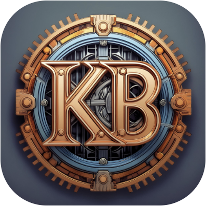

<p align="center" dir="auto">
    
</p>

# Katabole
_(ka-ta-buh-LAY) - A productive, timeless Go web framework._

Katabole offers a foundation generator for building your Go web application. `katabole gen` creates a project for you
from the [kbexample](https://github.com/katabole/kbexample) template, which puts together the following:
- [Chi](https://go-chi.io/#/README) for routing
- [Vite](https://vite.dev/) for front-end assets
- [Atlas](https://atlasgo.io/) for SQL DB management
- [Task](https://taskfile.dev) for task management
- [Docker](https://www.docker.com/get-started/) and [Air](https://github.com/air-verse/air) for smooth development
- [psql](https://www.postgresql.org/download/)
- Packages in [katabole](https://github.com/katabole) and [gorilla](github.com/gorilla), plus a few [others](https://github.com/katabole/kbexample/blob/main/go.mod)

Katabole is unique because it's a reference architecture more than a framework. It provides the generator, some well-defined
stable packages, and conventions. As a developer you learn how it fits together; it's transparent, not magic.

It's productive because in a matter of minutes, you're up and running. It's timeless because the code is yours. Katabole
may upgrade or swap out a thing or two (rarely, I hope), but your code (at least the Go part) will continue to build.

## Quick Start

Prerequisites: [Go](https://go.dev/doc/install), [Node](https://docs.npmjs.com/downloading-and-installing-node-js-and-npm), [Task](https://taskfile.dev/installation/), and [Docker](https://docs.docker.com/get-docker/).

Here's how to create an app named "MyApp", with the import path "github.com/myuser/myapp":
```bash
# Note: this installs katabole to ~/go/bin/ by default. You can add this to your path via `export PATH=$PATH:~/go/bin/`
go install github.com/katabole/katabole@latest
katabole gen --import-path github.com/myuser/myapp --title-name MyApp
cd myapp
task setup

# Run a dev server, then check out http://localhost:3000
task dev

# See what else you can do built-in
task -l
```

## Demo Videos

| Katabole Gen Demo | Katabole Walkthrough | Katabole Development Flow |
| - | - | - |
|<a href="https://www.loom.com/share/e6c942497c9d489d9d9e4e745afe942e"></a>|<a href="https://www.loom.com/share/bea7d6d6932a42708b9d469d066fe572"></a>|<a href="https://www.loom.com/share/ba11decf8a8e486695735a8c8de03383"></a>|

## Learning

- Find announcements and help on our [Google Group](https://groups.google.com/g/katabole-users)
- [Katabole Frequently Asked Questions](FAQ.md), including answers to the "why" questions
- [Guidance for first-time Go developers](FIRST-TIME.md)

## Contributing

Development happens primarily on [kbexample](https://github.com/katabole/kbexample), the canonical Katabole app that
also acts as a template.
